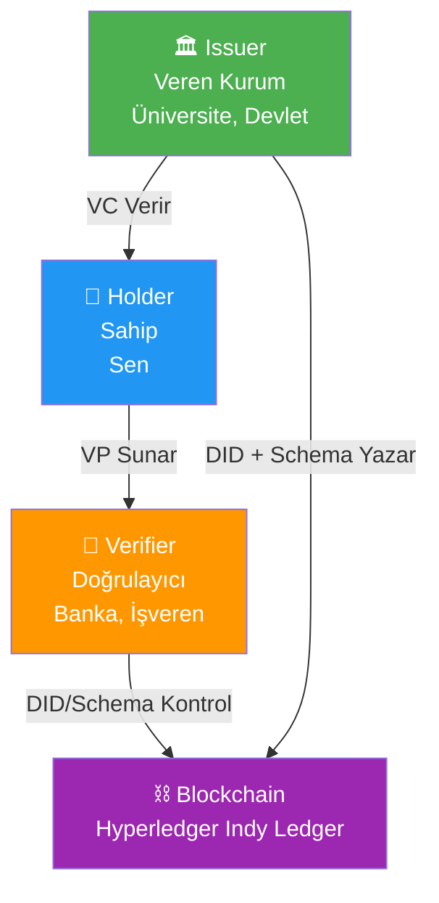
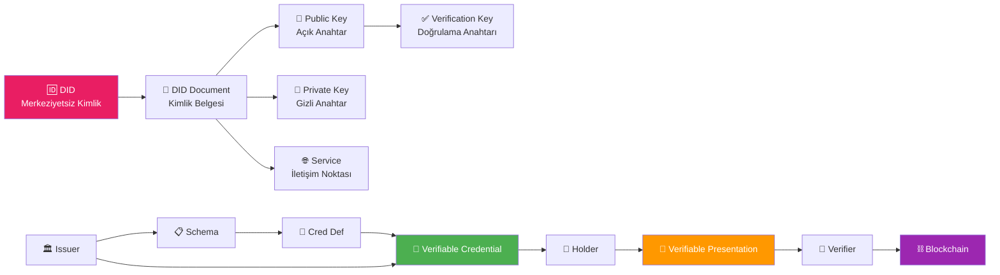

# 🔐 Hyperledger Indy & SSI — Sıfırdan Tam Rehber

> [!NOTE]
> Bu rehber, SSI (Self-Sovereign Identity) dünyasını hiç bilmeyen birine sıfırdan anlatmak üzere hazırlanmıştır.

---

## 📖 Bölüm 1: Gerçek Hayat Analojisi ile Başlayalım

### Bugünkü Kimlik Sistemi (Merkezi Model)

Düşün ki bir üniversite diplomasını bankaya göstermen gerekiyor:

```
Sen → Üniversiteye git → "Diplomamı onaylayın" de → Üniversite onaylar → Bankaya götür
```

**Sorunlar:**
- 🔴 Üniversite kapanırsa? Diplomanı kim onaylayacak?
- 🔴 Her yere gittiğinde üniversiteyi aramak zorundalar
- 🔴 Kişisel bilgilerin her yerde kopyalanıyor
- 🔴 Üniversite, senin nereye başvurduğunu takip edebilir

### SSI Modeli (Kendi Kendine Egemen Kimlik)

```
Üniversite → Sana dijital diploma verir (VC)
Sen → Cüzdanında saklarsın
Banka sorar → Cüzdanından gösterirsin → Banka blockchain'den doğrular
```

**Avantajlar:**
- ✅ Üniversite kapansa bile diploman geçerli
- ✅ Kimse seni takip edemez
- ✅ Sadece gerekli bilgiyi paylaşırsın
- ✅ Anında doğrulama

---

## 📖 Bölüm 2: Temel Kavramlar

### 🧩 1. DID (Decentralized Identifier — Merkeziyetsiz Tanımlayıcı)

**Ne?** Seni dijital dünyada temsil eden benzersiz bir adres. Kimseye bağlı değil, sana ait.

**Gerçek hayat benzeri:** TC Kimlik Numarası gibi düşün, AMA devlet vermez — **sen kendin oluşturursun**.

```
did:indy:sovrin:WRfXPg8dantKVubE3HX8pw
│    │     │     └── Benzersiz tanımlayıcı (senin ID'n)
│    │     └── Ağ adı (hangi blockchain)  
│    └── Metod (Indy kullanıyor)
└── DID şeması (her zaman "did" ile başlar)
```

**Önemli özellikler:**
- Kendin oluşturursun (self-generated)
- Merkezi bir otoriteye bağlı değil
- Birden fazla DID'in olabilir (iş için ayrı, kişisel için ayrı)
- Kalıcı ve değiştirilemez

---

### 🧩 2. Anahtar Çifti: Public Key & Private Key

**Ne?** Kriptografik anahtar çifti. Her şeyin temeli bu.

**Gerçek hayat benzeri:**

| Kavram | Gerçek Hayat Karşılığı |
|--------|------------------------|
| **Private Key (Özel Anahtar)** | Kasanın şifresi — sadece sende |
| **Public Key (Açık Anahtar)** | Herkesin görebileceği posta kutusu adresi |

```
┌─────────────────────────────────────────┐
│           ANAHTAR ÇİFTİ                 │
│                                         │
│  🔑 Private Key (Gizli)                │
│  ─────────────────────                  │
│  • Sadece sende kalır                   │
│  • İmza atmak için kullanılır           │
│  • KESİNLİKLE paylaşılmaz              │
│  • Örnek: 5BudF4dVCxT...               │
│                                         │
│  🔓 Public Key (Açık)                  │
│  ─────────────────────                  │
│  • Herkesle paylaşılır                  │
│  • İmzayı doğrulamak için kullanılır    │
│  • DID Document'te yayınlanır           │
│  • Örnek: CnEDk9HrMn...               │
│                                         │
└─────────────────────────────────────────┘
```

**Nasıl çalışır?**
1. Private Key ile bir mesajı **imzalarsın**
2. Başkaları Public Key ile imzanın **gerçekten senden geldiğini doğrular**
3. Private Key'i kaybedersen = kimliğini kaybedersin!

---

### 🧩 3. Verification Key (Doğrulama Anahtarı)

**Ne?** Public Key'in Hyperledger Indy'deki özel adı. Teknik olarak aynı şey, ama Indy ekosisteminde "verkey" denir.

```
verkey = public key (Indy terminolojisinde)
```

**Neden ayrı bir isim?** Çünkü Indy'de bir DID'in birden fazla anahtarı olabilir ve her birinin farklı bir amacı vardır:
- `verkey` → Kimlik doğrulama (authentication)
- `agreement key` → Şifreli iletişim (encryption)

---

### 🧩 4. DID Document (DID Belgesi)

**Ne?** DID'in arkasındaki bilgileri içeren JSON belgesi. "Bu DID'in sahibi kim, nasıl ulaşılır, nasıl doğrulanır" bilgilerini tutar.

**Gerçek hayat benzeri:** Kartvizit gibi düşün — ama kriptografik olarak doğrulanabilir bir kartvizit.

```json
{
  "@context": "https://w3id.org/did/v1",
  "id": "did:indy:sovrin:WRfXPg8dantKVubE3HX8pw",
  
  "verificationMethod": [
    {
      "id": "did:indy:sovrin:WRfXPg8dantKVubE3HX8pw#keys-1",
      "type": "Ed25519VerificationKey2018",
      "controller": "did:indy:sovrin:WRfXPg8dantKVubE3HX8pw",
      "publicKeyBase58": "CnEDk9HrMnmiHXEV1WFgbVCRteYnPBsJwGF3AVNz77A8"
    }
  ],
  
  "authentication": [
    "did:indy:sovrin:WRfXPg8dantKVubE3HX8pw#keys-1"
  ],
  
  "service": [
    {
      "id": "did:indy:sovrin:WRfXPg8dantKVubE3HX8pw#agent",
      "type": "AgentService",
      "serviceEndpoint": "https://agents.example.com/agent1"
    }
  ]
}
```

**Her alanın açıklaması:**

| Alan | Ne İşe Yarar | Analoji |
|------|--------------|---------|
| `@context` | Belgenin formatını tanımlar | Dil ayarı |
| `id` | Bu belgenin sahibi olan DID | TC No |
| `verificationMethod` | Doğrulama için kullanılan anahtarlar | İmza örnekleri |
| `authentication` | Kimlik doğrulamada hangi anahtar kullanılacak | Hangi imzanın geçerli olduğu |
| `service` | İletişim noktaları | Telefon/adres bilgisi |

---

### 🧩 5. VC (Verifiable Credential — Doğrulanabilir Kimlik Belgesi)

**Ne?** Dijital dünyada bir kurumun sana verdiği, kriptografik olarak imzalanmış belge.

**Gerçek hayat benzeri:**

| Fiziksel Dünya | Dijital Dünya (VC) |
|----------------|-------------------|
| Üniversite diploması | Diploma VC'si |
| Ehliyet | Sürücü belgesi VC'si |
| Doğum belgesi | Kimlik VC'si |
| İş sözleşmesi | Çalışan VC'si |

```json
{
  "@context": [
    "https://www.w3.org/2018/credentials/v1"
  ],
  "type": ["VerifiableCredential", "UniversityDegreeCredential"],
  
  "issuer": "did:indy:sovrin:UNIVERSITY_DID_123",
  
  "issuanceDate": "2024-01-15T00:00:00Z",
  
  "credentialSubject": {
    "id": "did:indy:sovrin:STUDENT_DID_456",
    "degree": {
      "type": "BachelorDegree",
      "name": "Bilgisayar Mühendisliği",
      "university": "İstanbul Teknik Üniversitesi",
      "gpa": "3.5"
    }
  },
  
  "proof": {
    "type": "Ed25519Signature2018",
    "created": "2024-01-15T00:00:00Z",
    "verificationMethod": "did:indy:sovrin:UNIVERSITY_DID_123#keys-1",
    "signatureValue": "eyJhbGciOiJFZERTQSIsImI2NCI6ZmF..."
  }
}
```

**Alanların açıklaması:**

| Alan | Açıklama |
|------|----------|
| `issuer` | Kim verdi? (Üniversitenin DID'i) |
| `credentialSubject` | Kime verildi? (Öğrencinin DID'i + bilgiler) |
| `proof` | Dijital imza (sahte olmadığının kanıtı) |
| `issuanceDate` | Ne zaman verildi? |

---

### 🧩 6. VP (Verifiable Presentation — Doğrulanabilir Sunum)

**Ne?** VC'lerden seçtiğin bilgileri birine gösterme eylemi. **Tüm bilgiyi göstermek zorunda değilsin!**

**Örnek:** Banka yaşını soruyor. Tüm kimliğini göstermek yerine sadece "18 yaşından büyüğüm: EVET" bilgisini paylaşırsın.

```
┌─────────────────────────────────────┐
│         VERIFIABLE CREDENTIAL       │
│                                     │
│  Ad: Ahmet Yılmaz                   │
│  Doğum: 1995-05-15                  │
│  TC: 12345678901                    │
│  Adres: İstanbul, Kadıköy           │
│  Kan Grubu: A Rh+                   │
│                                     │
└──────────┬──────────────────────────┘
           │
           ▼  (Selective Disclosure)
┌─────────────────────────────────────┐
│      VERIFIABLE PRESENTATION       │
│                                     │
│  18 yaşından büyük mü?: ✅ EVET     │
│                                     │
│  (Başka hiçbir bilgi paylaşılmadı)  │
└─────────────────────────────────────┘
```

Bu özelliğe **Zero-Knowledge Proof (Sıfır Bilgi Kanıtı)** denir ve Hyperledger Indy'nin en güçlü özelliklerinden biridir.

---

## 📖 Bölüm 3: Hyperledger Indy Mimarisi

### Sistem Aktörleri



### Üç Ana Aktör

| Aktör | Rol | Gerçek Hayat Örneği |
|-------|-----|---------------------|
| **Issuer (Veren)** | Credential oluşturur ve imzalar | Üniversite, Devlet, Hastane |
| **Holder (Tutan)** | Credential'ları cüzdanında saklar | Sen, Ben, Herkes |
| **Verifier (Doğrulayan)** | Credential'ları doğrular | Banka, İşveren, Otel |

### Blockchain'de Ne Saklanır?

> [!IMPORTANT]
> Hyperledger Indy blockchain'inde **kişisel veri SAKLANMAZ**! Sadece doğrulama için gereken bilgiler tutulur.

| Blockchain'de VAR ✅ | Blockchain'de YOK ❌ |
|----------------------|---------------------|
| DID'ler | Kişisel bilgiler |
| DID Document'ler | Credential içerikleri |
| Schema tanımları | İsim, adres, TC no |
| Credential Definition'lar | Fotoğraflar |
| Revocation Registry | Özel anahtarlar |

---

## 📖 Bölüm 4: Akış Senaryosu (Tam Örnek)

### Senaryo: Ahmet'in Üniversite Diploması

```
Adım 1: HAZIRLIK
═══════════════════════════════════════════════
  
  İTÜ (Issuer):
  ├── DID oluşturur: did:indy:sovrin:ITU_123
  ├── Private/Public key çifti üretir
  ├── DID'ini blockchain'e yazar
  ├── "Diploma" Schema'sını tanımlar
  │   └── alanlar: ad, bölüm, mezuniyet_yılı, gpa
  └── Credential Definition oluşturur

  Ahmet (Holder):
  ├── DID oluşturur: did:indy:sovrin:AHMET_456
  ├── Private/Public key çifti üretir
  └── Digital cüzdan kurar (mobil uygulama)


Adım 2: CREDENTIAL VERME
═══════════════════════════════════════════════
  
  İTÜ → Ahmet'e diploma VC'si verir:
  {
    issuer: "did:indy:sovrin:ITU_123",
    subject: "did:indy:sovrin:AHMET_456",
    claims: {
      ad: "Ahmet Yılmaz",
      bölüm: "Bilgisayar Mühendisliği", 
      mezuniyet_yılı: 2024,
      gpa: 3.5
    },
    imza: "İTÜ'nün private key'i ile imzalanmış"
  }
  
  Ahmet → VC'yi cüzdanına kaydeder ✅


Adım 3: DOĞRULAMA
═══════════════════════════════════════════════
  
  Ahmet bir bankaya iş başvurusu yapıyor.
  
  Banka (Verifier): "Üniversite diplomanı göster"
  
  Ahmet → Cüzdanından VP oluşturur:
  - Sadece "bölüm" ve "mezuniyet_yılı" paylaşır
  - Ad ve GPA'yı paylaşMAZ
  
  Banka → VP'yi alır
  Banka → Blockchain'den İTÜ'nün public key'ini çeker
  Banka → İmzayı doğrular ✅
  Banka → Schema'yı kontrol eder ✅
  Banka → "Tamam, diploma geçerli!" ✅
```

---

## 📖 Bölüm 5: Hyperledger Indy Teknik Bileşenleri

### Schema (Şema)

Bir credential'ın hangi alanları içereceğini tanımlayan şablon.

```json
{
  "name": "diploma",
  "version": "1.0",
  "attrNames": ["ad", "bolum", "mezuniyet_yili", "gpa"]
}
```

### Credential Definition (Cred Def)

Bir Issuer'ın belirli bir Schema'ya göre credential verebileceğini ilan etmesi.

```json
{
  "id": "creddef:indy:sovrin:ITU_123:diploma:1.0",
  "schemaId": "schema:indy:sovrin:diploma:1.0",
  "type": "CL",
  "tag": "diploma_v1",
  "value": {
    "primary": { "...kriptografik parametreler..." },
    "revocation": { "...iptal bilgileri..." }
  }
}
```

### Revocation (İptal)

Bir credential'ı geçersiz kılma mekanizması.

**Örnek:** Bir doktor lisansı askıya alındığında, hastane VC'yi revoke eder ve artık hiçbir verifier bu credential'ı geçerli olarak kabul etmez.

---

## 📖 Bölüm 6: Kavram Haritası



---

## 📖 Bölüm 7: Sıkça Sorulan Sorular

### ❓ DID ile normal kullanıcı adı arasındaki fark ne?
- Kullanıcı adı → Bir şirketin veritabanında saklanır (Google, Facebook)
- DID → Blockchain'de, merkezi olmayan şekilde, **sana ait**

### ❓ Private key'imi kaybedersem ne olur?
- Kimliğine erişimi kaybedersin. Bu yüzden **yedekleme kritik**.
- Bazı sistemlerde "recovery" mekanizmaları var (social recovery, seed phrase)

### ❓ Blockchain'i herkes okuyabilir mi?
- Evet, ama sadece DID'ler ve şemaları görürler
- **Kişisel bilgi blockchain'de değil**, senin cüzdanında

### ❓ Hyperledger Indy ile Ethereum farkı ne?
- Indy → Sadece kimlik için özelleşmiş, VC desteği built-in
- Ethereum → Genel amaçlı, kimlik için ekstra katman gerekir (ERC-725 vb.)

---

> [!TIP]
> Aşağıdaki interaktif demo uygulamasını çalıştırarak tüm bu kavramları pratik olarak deneyimleyebilirsin!
> 
> Uygulama dizini: [SSI Demo App](file:///Users/personaone/source/ssi)
